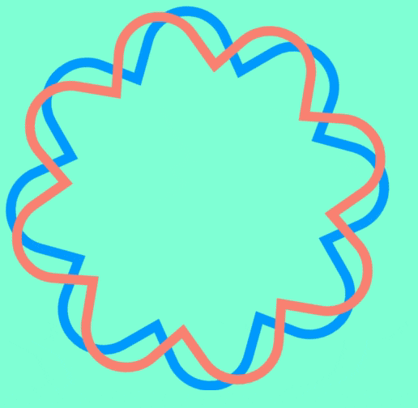
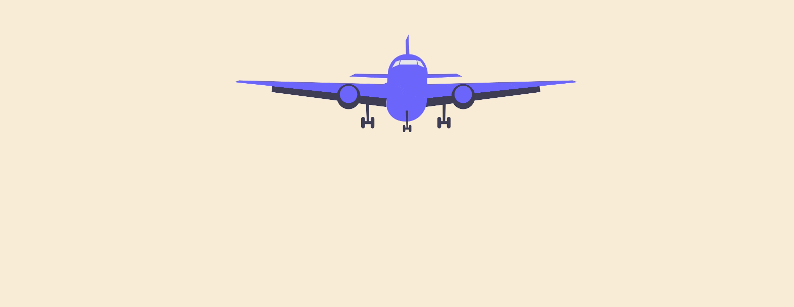

# crea-tu-primer-svg
En este workshop haremos tres ejercicios para empezar a desarrollar tus habilidades con animaciones SVG. Vamos a trabajar sobre tres animaciones: estrellas, tarjetas de crédito y un avión. 

💪💪 **¡Así que vamos con toda  crear tus primeras animaciones con SVG!** 💪💪
## Ejercicio 1 - Estrella

Para este primer ejercicio vamos a hacer rotar unas estrellas con bordes redondeados. 

La secuencia de animación debe cumplir con los siguientes requerimientos: 
* Ambas estrellas deben rotar 360° en el tiempo que dura la animación.
* La animación debe durar 5 segundos.
* Las estrellas deben rotar desde el centro de la imagen.
* La función de aceleración puede ser la predeterminada.

Adicionalmente para completar la tarea: la primera estrella tiene él id `estrellaAzul` y la segunda estrella tiene él id `estrellaDurazno` usando estos selectores puedes hacer rotar las estrellas para crear la animación.

_¿Se te ocurre cómo podrías escribir menos código?_

## Ejercicio 2 - Tarjetas de crédito

En este ejercicio vamos a hacer aparecer una por una las tarjetas que están en él SVG.

La animación debe: 

* Empezar con las tarjetas no siendo visibles.
* Cuando aparezcan deben aparecer 30 pixeles movidas hacia arriba de su posición original para al final llegar a su lugar original.
* La animación debe tener una duración de 2 segundos
* La primer tarjeta por aparecer debe ser la de atras y posteriormete cada segundo aparecen en este orden: la de la mitad y por último la de adelante.
* Cuando la animación termine deben estar en la posición original 
  
Para completar esta tarea las tarjetas tiene los siguientes ids: `CreditCardBack` la de más atras, `CreditCardMiddle` la del medio y `CreditCardForeground` la del frente.

## Ejercicio 3 - Avión

En este ejercicio vamos a simular como si un avión estuviera aterrizando. La animación debe: 

* Mover 100px hacia arriba de su posición original al comenzar la animación
* El avión va a aparecer en un tamaño más pequeño inicialmente y va a tomar su posición original al terminar. 

En este caso debes averiguar ❓ cual es el id que debes usar para hacer la animación.

